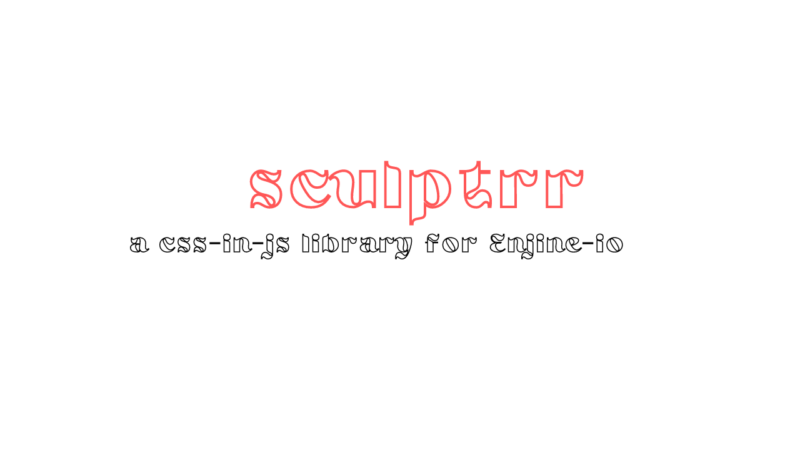

# sculptrr

Sculptrr, a css-in-js library for Enjine-Io a.k.a DroidScript Hybrid >3

NOTE : This plugin is depracated, check the alternative : [Metro](https://github.com/oarabiledev/metro)

## Getting Started >3

Firstly download the `sculptrr.core.js` file then load in into your project like :

```javascript
ui.script("sculptrr.core.js");
```

The next step is using it.

The library extends `ui.Control` - this class is used to build elements in hybrid.

So we have added our own method, you can access it using :

```javascript
ui.script("sculptrr.core.js");
class Main extends App {
 onStart() {

  this.layMain = ui.addLayout("main", "linear", "fillxy,vcenter");

  this.txt = ui.addText(this.layMain, "My Hybrid app");

  // Usage Of Sculptrr Method
  this.txt.sculptrr({
   position: "relative",
   color: "red",

   "&:active": {
    boxShadow: "0px, 0px, 0px, 0px",
    top: "5px",
    left: "5px"
   }
  });
 }
}
```

## Usage >3

Here is working code examples and usage.

```javascript

// This is the most basic way to use

this.btn.sculptrr({
    color: 'red',
})

// We can go on to add pseudo-elements like this :

this.btn.sculptrr({
    color: 'red',
    "&:active": {
    boxShadow: "0px, 0px, 0px, 0px",
    top: "5px",
    left: "5px"
   },
   "&:hover": {
    boxShadow: "0px, 0px, 0px, 0px",
    top: "5px",
    left: "5px"
   }
})

// We can also do parent elements selection like 

this.btn.sculptrr({
   " *": {
    marginLeft: left,
    marginTop: top,
    marginRight: right,
    marginBottom: bottom
   }
  })

// We can go on to add media queries 

this.btn.sculptrr({
    "@media (max-width: 1250px)" : {
        /* */
    }
})

// Anything can be added, just add "" and eqaute to an object
//just like the media query
```

Thanks For The Interest,
Wishing You Happy Coding >3
